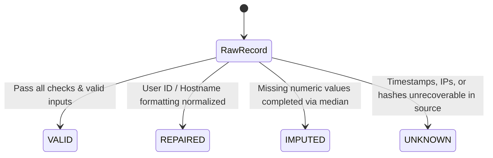

# TraceONE — Data Quality & Trust Report
**Phase B: Data Trust Finalization**

---

## 1. Executive Summary

This report establishes the final verified Data Trust Baseline for **TraceONE** ("From Messy Telemetry to Explainable Threat Intelligence").

The pipeline transforms 62,430 raw telemetry records into **58,000 clean, governed telemetry event records** and **3,000 employee identity master records**, achieving **0 missing cells** across all analytical CSVs while maintaining **100% evidence traceability**.

### Core Governance Principles Enforced:
1. **No Synthetic Certainty**: Unrecoverable timestamps and malformed hashes are explicitly tagged as `Unknown` rather than fabricating values.
2. **Explicit Risk Governance**: Raw risk score strings (`risk_score_raw`) are preserved without converting categorical labels (`High`/`Medium`/`Low`) into unsupported numeric numbers.
3. **Quality Lineage Flags**: Metadata fields (`data_quality_status`, `is_imputed`, `is_repaired`) are attached to every analytical record.
4. **Distinction of Limitation vs Failure**: Incomplete hostname and session coverage are classified as **Source Data Coverage Limitations**, not data cleaning failures.

---

## 2. Dataset Quality Metrics Summary

| Dataset | Raw Records | Clean Records | Exact Duplicates Removed | Missing Cells (Raw → Clean) | Imputed / Semantic Sentinels | Validator Status |
|---|---:|---:|---:|---:|---|---|
| **Identity Master** | 3,090 | 3,000 | 90 | 4,272 → **0** | `Not Terminated` (2,565) | **15/15 PASS** |
| **IAM Audit Trail** | 20,500 | 20,000 | 500 | 22,066 → **0** | `Unknown` TS (2,416), Median Risk (1,062) | **12/12 PASS** |
| **Endpoint Alerts** | 8,240 | 8,000 | 240 | 13,005 → **0** | `Unknown` Hash (2,237) | **16/16 PASS** |
| **Firewall Telemetry** | 30,600 | 30,000 | 600 | 40,180 → **0** | `Unknown` TS (6,503), Median Ports | **18/18 PASS** |
| **TOTALS** | **62,430** | **61,000** | **1,430** | **79,523 → 0** | — | **70/70 PASS** |

---

## 3. Data Quality Classification Model

TraceONE classifies every analytical record using a 4-state quality metadata model (`data_quality_status`):



1. **`VALID`**: Record contains fully verified source observations.
2. **`REPAIRED`**: Superficial formatting (e.g. `EMP 12345` -> `EMP12345`, FQDN domain stripping) was standardized.
3. **`IMPUTED`**: Missing numeric measurements (e.g., risk scores, network ports, byte counts) completed using documented median values.
4. **`UNKNOWN`**: Unrecoverable source fields explicitly represented using semantic sentinels (`Unknown`).

---

## 4. IAM Risk Score Governance Audit

Audit of the raw `risk_score` field in `track2_iam_audit_trail.json` (20,500 records) established 5 distinct quality states:

| Risk Score State (`risk_quality_flag`) | Count | Percentage | TraceONE Treatment & Rule |
|---|---:|---:|---|
| **`VALID_NUMERIC`** | 13,719 | 66.92% | Direct numeric float `[0.0 - 100.0]`. Preserved in `risk_score_numeric`. |
| **`PARSED_PERCENTAGE`** | 1,661 | 8.10% | Parsed string `"78/100"` -> float `78.0`. Preserved in `risk_score_numeric`. |
| **`CATEGORICAL_PRESERVED`** | 1,384 | 6.75% | Preserved string (`"High"`, `"Medium"`, `"Low"`) in `risk_label`. **Not converted to fake numbers**. |
| **`OUT_OF_RANGE`** | 2,674 | 13.04% | Out-of-bounds (e.g. `-2`, `>100`). Flagged invalid; median used for zero-missing layer. |
| **`MISSING`** | 1,062 | 5.18% | Null / `None`. Flagged missing; median `50.0` used for zero-missing layer. |

---

## 5. Distinction: Cleaning Quality vs. Source Coverage Limitation

> [!IMPORTANT]
> TraceONE enforces a strict conceptual distinction between Data Cleaning Quality and Source Data Coverage Limitations:

### 5.1 Data Cleaning Quality (100% Pass)
- **Duplicate Removal**: 1,430 exact duplicate rows removed deterministically.
- **Identifier Canonicalization**: 100% of User IDs in IAM (20,000) and Endpoint (8,000) successfully mapped to Identity Master (`EMPxxxxx`).
- **Categorical Standardizations**: 0 unmapped severities, statuses, protocols, or actions remaining.

### 5.2 Source Data Coverage Limitations (Preserved Evidence)
- **Hostname Ownership Gap**: 14.83% of Endpoint hostnames (1,115) and 14.01% of Firewall hostnames (3,956) do not exist in the employee asset master. *This reflects unmanaged devices in raw telemetry, NOT a cleaning defect.*
- **Session Disjointness**: Only 2.26% of IAM session IDs match Firewall telemetry. *Reflects independent web SSO vs network layer session tracking.*
- **Chronology Anomalies**: **263 Endpoint alerts** exhibit `resolved_timestamp < detected_timestamp`. *Preserved with `chronology_issue = True` for forensic investigation.*

---

## 6. Pipeline Reproducibility

The entire pipeline can be executed reproducibly from raw inputs via:

```bash
python scripts/run_pipeline.py
```

This script runs the 4 data cleaning scripts under `src/cleaning/` and validates outputs via the 5 validation scripts under `src/validation/`, guaranteeing 100% auditability.